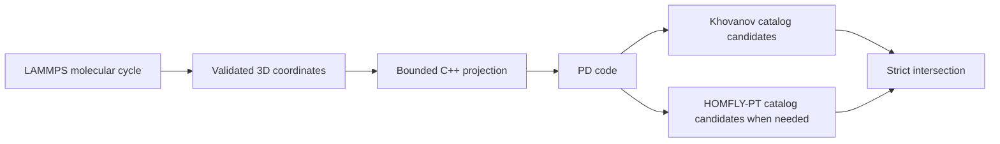

# hybrid_knot_indexer

Identify a closed molecular knot by combining the candidate sets from integral
Khovanov homology and the mirror-image HOMFLY-PT polynomial.

Both are catalog filters, not complete invariants. If Khovanov yields zero or
one catalog candidate, that result is already definitive within the finite
catalog and the slower HOMFLY-PT backend is skipped. Ambiguous Khovanov rows are
resolved by strict set intersection with HOMFLY-PT candidates. Backend failures
raise errors; an empty list means no catalog match and is never replaced by the
other invariant's union.

## Requirements

- Python 3.10 or newer
- A C++17 compiler (`g++` by default, or set `CXX`)
- A Java runtime for nontrivial Khovanov computations
- SageMath only when an ambiguous result requires HOMFLY-PT computation;
  `sage` is used by default, or supply an executable through `--sage` or
  `sage_path`

The repository is independently cloneable. All organization-owned source,
catalogs, native code, and JavaKh bytecode are ordinary tracked files—not Git
submodules. Linux, Bash, and symbolic links are not required.

## Command-line usage

```text
python src/main.py --che path/to/molecule.data
```

Optional controls:

```text
python src/main.py --che molecule.data --java /path/to/java --sage /path/to/sage --projection-timeout 120 --khovanov-timeout 120 --homfly-timeout 120 --max-heap 4g
```

Each candidate name is printed on its own line. Invalid input, missing tools,
backend failures, and timeouts produce a diagnostic and exit status 2.

## Pipeline



Molecular parsing enforces one connected 2-regular bond cycle. Projection is
bounded and reports degenerate failure instead of looping forever. The bundled
Khovanov and HOMFLY-PT indexers validate inputs and propagate backend errors.
Every stage is invoked by a fixed local path; no runtime code changes
`sys.path` or invokes Git submodule commands.

## Python API

```python
from che_file_to_knot_name import che_file_to_knot_name
from hybrid_indexer import hybrid_indexer

names_from_file = che_file_to_knot_name("molecule.data")
names_from_pd = hybrid_indexer(pd_code)
```

## Tests and auxiliary C implementation

Run fast contract and end-to-end regressions:

```text
python -m unittest discover -s tests -v
```

Run all committed molecular samples explicitly:

```text
python src/main.py --test
```

Backend and timeout controls are honored in `--test` mode. The full automated
integration test is opt-in because it compiles native code and invokes JavaKh
and SageMath for all 22 samples:

```bash
TKI_RUN_FULL_INTEGRATION=1 \
TKI_SAGE_EXECUTABLE=/path/to/sage \
TKI_JAVA_MAX_HEAP=1g \
python -m unittest discover -s tests -v
```

The regression requires exact candidate sets. `K8a8` deliberately expects
`K10n6, K8a8`: both catalogued knots share the tested Khovanov and HOMFLY-PT
values, so the available invariants cannot claim a unique result.

`src/link_pdcode_c` is a standalone C11 projection implementation with its own
build and test scripts. Audited dependency revisions are recorded in
`VENDORED_DEPENDENCIES.md`. No Python packages are installed or published by
maintenance.

## Citation

If you use this repository in academic work, please cite it as:

```bibtex
@software{topologicalknotindexer_hybrid_knot_indexer,
  author = {{TopologicalKnotIndexer contributors}},
  title = {{hybrid\_knot\_indexer}},
  year = {2026},
  url = {https://github.com/TopologicalKnotIndexer/hybrid_knot_indexer}
}
```
